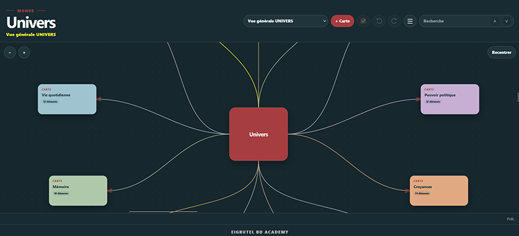
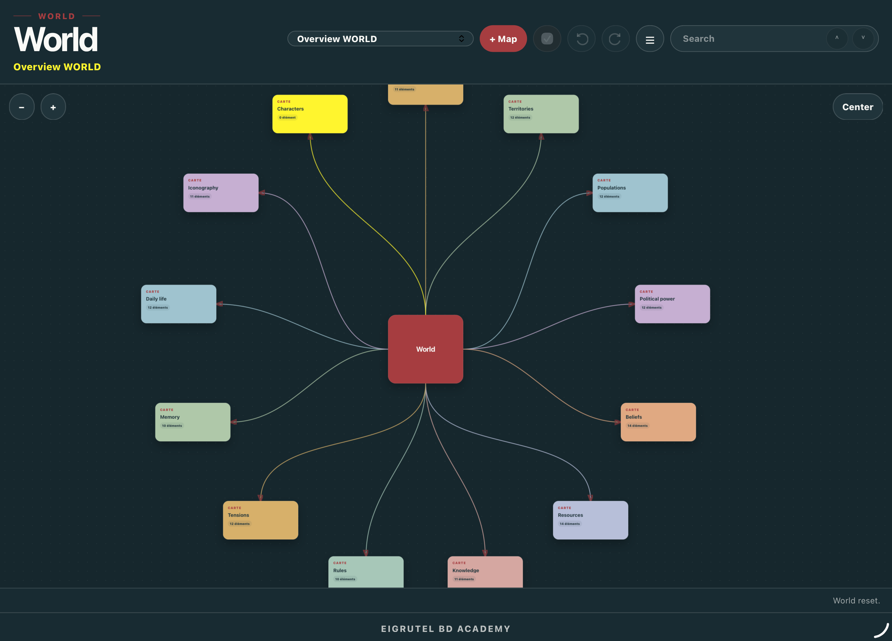
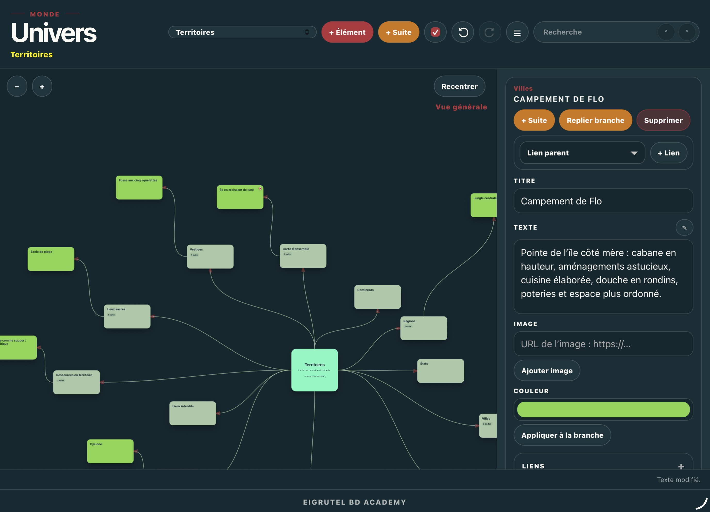
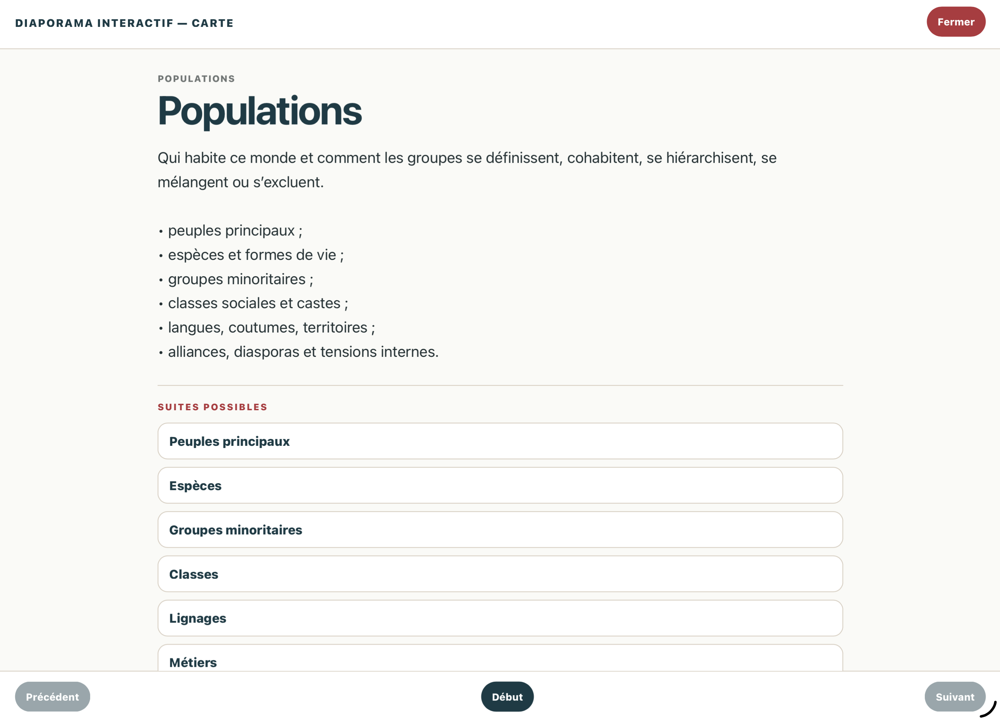
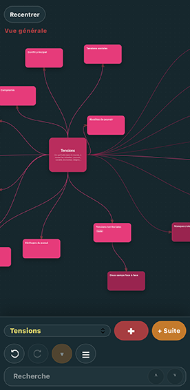

# Univers

**Univers** est une application web bilingue et autonome d’Eigrutel Lab pour cartographier les éléments et les relations d’un monde, réel ou imaginaire.

Elle peut servir à représenter aussi bien un univers fictionnel complexe qu’une boutique, un événement historique, une famille ou tout autre ensemble composé d’éléments reliés entre eux.

**Version stable : 1.0.0 — 09-08-2026**

## Ouvrir l’application

GitHub Pages :

`https://eigrutel.github.io/eigrutel-univers/univers.html`

L’application est contenue dans un fichier HTML autonome et fonctionne directement dans un navigateur moderne.

## Aperçu

### Vue générale — français

<p align="center">
  
</p>

### Overview — English

<p align="center">
  
</p>

### Développer et relier les éléments

<p align="center">
  
</p>

### Diaporama interactif

<p align="center">
  
</p>

### Interface mobile

<p align="center">
  
</p>

## Principe

Univers associe deux niveaux de représentation :

- une **vue générale**, qui rassemble les grandes cartes du monde ;
- des **mindmaps dédiées**, qui développent chaque domaine.

Les éléments peuvent être organisés en branches, reliés librement à l’intérieur d’une carte et connectés entre différentes cartes.

Le modèle par défaut propose notamment les domaines suivants :

- Origines
- Territoires
- Populations
- Personnages
- Pouvoir politique
- Croyances
- Ressources
- Savoirs
- Règles
- Tensions
- Mémoire
- Vie quotidienne
- Iconographie

Ce modèle est une base de travail : toutes les cartes et fiches peuvent être modifiées, supprimées ou remplacées.

## Adaptabilité

La structure n’est pas limitée au *worldbuilding* de fiction.

Exemples :

- **monde imaginaire** : peuples, territoires, croyances, pouvoirs, ressources, histoire ;
- **boutique de fleuriste** : équipe, fournisseurs, produits, clientèle, locaux, organisation ;
- **événement historique** : acteurs, lieux, causes, chronologie, alliances, conséquences ;
- **univers familial** : personnes, générations, lieux, relations, souvenirs, événements.

## Fonctions principales

- interface français / anglais ;
- création et organisation de cartes ;
- mindmaps hiérarchiques ;
- relations libres entre fiches ;
- relations intercartes ;
- déplacement et repli des branches ;
- ajout d’images ;
- recherche ;
- annuler / rétablir ;
- sauvegarde locale ;
- export et import JSON ;
- exports PDF ;
- livre-monde ;
- diaporamas interactifs ou linéaires ;
- mode clair / obscur.

## Données et sauvegarde

Les données sont enregistrées localement dans le navigateur.

L’export JSON permet de conserver, transférer ou archiver un univers indépendamment du stockage local.

Les images intégrées depuis un fichier sont incorporées aux données et peuvent donc augmenter fortement la taille du JSON. Les images utilisant une URL restent plus légères mais dépendent de leur source externe.

## Documentation du modèle par défaut

Les textes complets du modèle fourni avec Univers sont disponibles sous forme imprimable :

- [Français — contenu du modèle par défaut](docs/univers-contenu-modele-par-defaut.pdf)
- [English — default model content](docs/world-default-model-content.pdf)

## Fichiers du dépôt

```text
univers.html
index.html
README.md
NOTICE.md
LICENSE.md
CHANGELOG.md
ARCHITECTURE.md
docs/
  univers-contenu-modele-par-defaut.pdf
  world-default-model-content.pdf
favicon/
  fav32.png
```

Le favicon est attendu dans `favicon/fav32.png`.

## Auteur

Simon Léturgie

Programme conçu et développé dans le cadre d’**Eigrutel BD Academy**.

## Licences

- **Code** : GNU Affero General Public License v3.0 ou version ultérieure.
- **Documentation et modèles** : Creative Commons Attribution-ShareAlike 4.0 International, sauf mention contraire.
- **Marques, logos et signes distinctifs** Eigrutel / Eigrutel Lab / Eigrutel BD Academy : réservés.

Voir [LICENSE.md](LICENSE.md) et [NOTICE.md](NOTICE.md).
